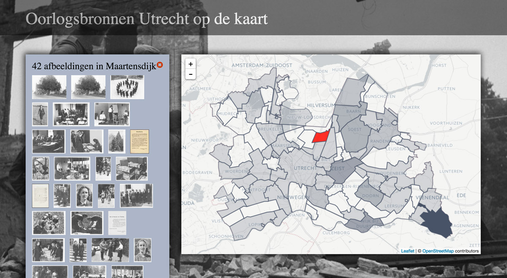

#Pilot Geocoderen Oorlogsbronnen - data

##results

The ndjson files contain the geographical enrichments for each collection in Oorlogsbronnen: 

```
ARCHIEVEN, ARCHIEVENWO2, BBNA, BBWO2, DANS, DIGCOL, DIMCON, GETUIGENVERHALEN, GVNEVDO01, GVNEVDO02, GVNEVDO03, GVNMUSE01, GVNNIOD02, IIO_LEGER, IIO_ONAFHANKELIJK, IPNV, KITLV, MFORCE-MEDIA, NATIONAAL-ARCHIEF, OCLC, OIB, OORLOGSGRAVEN, OORLOGSMONUMENTEN, RAL
```

###Keys in ndjson files

<table>
<tr>
<td> obid </td><td>oorlogsbronnen identifier</td>
</tr>
<tr>
<td> dcid </td><td>collection identifier</td>
</tr>
<tr>
<td> name </td><td>geographical name in record (from coverage, subject, title or description)</td>
</tr>
<tr>
<td> lat </td><td>latitude (wgs84)</td>
</tr>
<tr>
<td> lng </td><td>longitude (wgs84)</td>
</tr>
<tr>
<td> exid </td><td>external id of geographical entity (mostly geonames uri, sometimes TGN uri or BAG id)</td>
</tr>
<tr>
<td> pname </td><td>name of place containing or equal to geographical entity</td>
</tr>
<tr>
<td> pexid </td><td>place external id (mostly geonames)</td>
</tr>
<tr>
<td> mname </td><td>name of municipality</td>
</tr>
<tr>
<td> mexid </td><td>municipality external id (mostly geonames)</td>
</tr>
<tr>
<td> prname </td><td>name of province</td>
</tr>
<tr>
<td> prexid </td><td>province external id (geonames)</td>
</tr>
<tr>
<td> cname </td><td>name of country</td>
</tr>
<tr>
<td> cexid </td><td>country external id (geonames)</td>
</tr>
</table>

For places outside The Netherlands municipalities and provinces have not been added.


##false positives

In [falsepositives.geojson](falsepositives.geojson) you will find some results we rejected. Funny!

##woonplaatsen

In the [MySQL table woonplaatsen](woonplaatsen.sql) we aligned 2493 BAG places with their GeoNames counterparts. Records include hierarchy (municipality, province), simplified geojson BAG borders for use in web applications, and of course BAG id's and GeoNames coordinates.

We used this table to quickly find hierarchy without making apicalls to GeoNames and to create a map that visualises the results.

