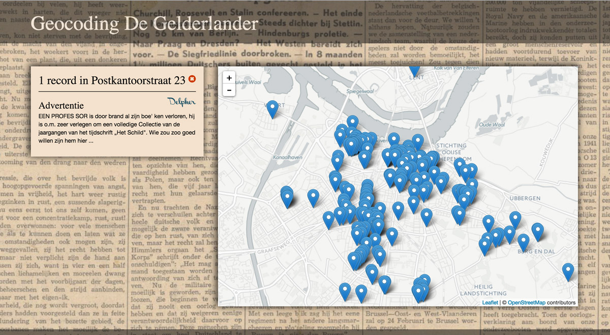

#Geocoding De Gelderlander

Dit document beschrijft werkwijze en resultaten van een kleine test, uitgevoerd in mei 2016 door Menno den Engelse, met 190 nummers van de Nijmeegse krant _De Gelderlander_. Gekeken is of uit de artikelen geografische namen (plaatsen, adressen, etc.) te extraheren en te geocoderen waren.

##werkwijze

Van een [zoekresultaatpagna op Delpher](http://www.delpher.nl/nl/kranten/results?page=1&maxperpage=500&cql%5B%5D=(ppn+exact+%22401021084%22)&coll=dddtitel) zijn van 190 nummers van De Gelderlander de identifiers geschraapt, waarmee vervolgens de didls opgehaald konden worden. Op basis van de didls zijn de altos opgehaald en geparsed, waarmee uiteindelijk ook de ocr-tekst van de artikelen zelf ingelezen konden worden.

De tekst van de artikelen is tegen een [postagger](http://www.clips.ua.ac.be/pages/pattern-nl) aangehouden en de eigennamen die dat opleverde zijn, als ze door de reguliere expressie `(^| )(?i)(te|uit|in|op|bij|naar)(?-i) (de|het|den)?[ ]?Eigennaam` kwamen, opgeslagen.

Adressen werden door de postagger wat lastig gevonden, en aangezien die in kranten, in ieder geval in de advertenties in De Gelderlander veelvuldig aanwezig zijn, is daar met de reguliere expressie ` ([A-Z][a-z]+(straat|singel|laan|plein|gas|weg) [0-9]{1,3})[ ,.?]` apart naar gezocht.

De aldus verzamelde termen zijn tegen de Historische Geocoder gehouden. De termen die daarbij geen resultaat opleverden zijn daarna nog eens tegen de GeoNames api gehouden.

Termen met meerdere resultaten zijn niet opgenomen.

Omdat Nederland creatieve straatnaamcommissies heeft zijn alle straten die geen 'straat', 'weg', 'laan' of 'plein' in de naam hadden, een stuk of vijftig waren het er, verwijderd. Zo worden we nu niet lastig gevallen met straten genaamd 'Bevrijding', 'Vasteland', etc.

##resultaten

__190__ nummers van De Gelderlander  
__407__ pagina's  
__6058__ artikelen

__8592__ termen zijn met bovenstaande werkwijze uit __3406__ artikelen gehaald  
__1484__ daarvan zijn gegeocodeerd  
__4494__ daarvan leverden geen resultaat op en zijn niet gegeocodeerd  
__2617__ daarvan leverden meerdere resultaten op en zijn niet gegeocodeerd

Eén term kan natuurlijk in meerdere artikelen voorkomen. 

De resultaatloze termen zijn soms gewoon niet geografisch (`H Doopsel`), soms door ocr-foutjes (`Hszelstraat 10`) en soms door archaïsche spelling (`Groenewoudscheweg 242`) niet aan de juiste locatie gekoppeld.

Veel termen met meerdere resultaten zijn adressen die ook elders in 't land voorkomen (`Parkweg 106`). 

De 1484 gegeocodeerde termen zijn voornamelijk van het type Address:

__1120__ Address (via [HGC](http://erfgeo.nl/))  
__229__ Place (via HGC)  
__51__ populated place (via [GeoNames](http://www.geonames.org/))  
__28__ Country (via HGC)  
__11__ Street (via HGC)  
__4__ farm, Province, capital of a political entity  
__3__ Municipality, seat of a first-order administrative div, section of populated place  
__2__ seat of a second-order administrative di, church, hotel, region, seat of a third-order administrative div  
__1__ area, first-order administrative division, bus stop, park, stadium, island, populated locality, cemetery, seat of a fourth-order administrative di, historical political entity

##Data verbeteren en schonen

De [kaart met resultaten](http://islandsofmeaning.nl/projects/gelderlander/) is gemaakt op basis van de ongeschoonde data en laat snel foutjes zien. Alle adressen buiten Gelderland zijn verdacht, hotel `The Times` is vast blij met de onterechte exposure. Er is wat voor te zeggen om die adressen en onduidelijke typen langs te lopen en waar nodig te verwijderen.

_figuur 1: kaart met o.a. adressen in Nijmegen_

De data kan ongetwijfeld verbeterd worden door:

- adressen met meerdere resultaten nogmaals te geocoderen binnen Nijmegen (`Parkweg 106, Nijmegen`)
- de reguliere expressie achterwege te laten en de 'eigennamen' die dat oplevert te geocoderen (met kans op resulaten als de straat 'Bevrijding') of juist binnen de reeds gegeocodeerde termen te zoeken
- omgekeerd in de artikelen te zoeken naar de 335 Gelderse woonplaatsnamen.

Je zou de crowd of jezelf in kunnen zetten om de data handmatig te verbeteren: 

- keuze maken uit meerdere resulaten
- gegeocodeerde resultaten controleren
- resultaatloze termen laten geocoderen (locaties als `Textielschool`, `St Barbara Kerkhof`, `Canisius Ziekenhuis` of `Gewestelijk Arbeidsbureau Nijmegen` vind je in geen enkele geocoder terug)

Sowieso is het voor een quick win handig de meestgebruikte termen handmatig even na te lopen.

